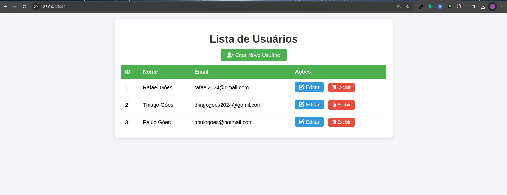

# 🚀 Projeto CRUD com Flask

  <!-- Substitua pelo caminho da sua imagem de capa -->

Este é um aplicativo desenvolvido com Flask, projetado para gerenciar registros de forma eficiente. Abaixo está a estrutura de diretórios do projeto e a descrição de cada arquivo.

## 📂 Estrutura do Projeto

```
├── app                      # Diretório principal da aplicação
│   ├── __init__.py         # Inicialização da aplicação Flask
│   ├── models.py           # Definição dos modelos de dados
│   ├── __pycache__         # Cache dos arquivos Python compilados
│   │   ├── __init__.cpython-312.pyc
│   │   ├── models.cpython-312.pyc
│   │   └── routes.cpython-312.pyc
│   ├── routes.py           # Definição das rotas da aplicação
│   └── templates           # Diretório de templates HTML
│       ├── create.html     # Template para criar novos registros
│       ├── list.html       # Template para listar registros
│       └── update.html     # Template para atualizar registros
├── instance                 # Diretório de instâncias
│   └── banco.sqlite         # Banco de dados SQLite
├── run.py                   # Script para rodar a aplicação
├── static                   # Diretório de arquivos estáticos
│   └── style.css            # Estilos CSS da aplicação
└── venv                     # Ambiente virtual
```

## 📜 Descrição dos Arquivos

- **app/__init__.py**: Este arquivo inicializa a aplicação Flask e configura as extensões necessárias.

- **app/models.py**: Contém a definição dos modelos de dados que representam as entidades da aplicação. Aqui você define como os dados são estruturados e como interagem com o banco de dados.

- **app/routes.py**: Define as rotas da aplicação, que conectam as URLs às funções de controle correspondentes. Cada rota gerencia uma parte da lógica da aplicação.

- **app/__pycache__**: Este diretório armazena os arquivos Python compilados para melhorar a performance do aplicativo. Não é necessário editar nada aqui.

- **app/templates/**: Este diretório contém os arquivos HTML que a aplicação renderiza.
  - **create.html**: Formulário utilizado para criar novos registros. Os usuários podem inserir dados que serão salvos no banco de dados.
  - **list.html**: Exibe uma lista de todos os registros armazenados, permitindo que os usuários visualizem os dados existentes.
  - **update.html**: Formulário utilizado para atualizar registros existentes, permitindo que os usuários modifiquem informações já salvas.

- **instance/banco.sqlite**: Este é o arquivo do banco de dados SQLite que armazena os dados da aplicação. Todas as operações de criação, leitura, atualização e exclusão (CRUD) são realizadas nesse banco.

- **run.py**: Ponto de entrada da aplicação. Ao executar este script, a aplicação Flask é iniciada e começa a escutar as requisições.

- **static/style.css**: Arquivo CSS que contém os estilos aplicados à aplicação, garantindo que a interface do usuário tenha um design atraente.

- **venv/**: Diretório que contém o ambiente virtual. Ele isola as dependências do projeto, garantindo que não haja conflitos com outras aplicações Python que você possa ter.

## ⚙️ Instruções para Execução

1. Clone o repositório.
2. Ative o ambiente virtual:
   ```bash
   # No Linux ou Mac
   source venv/bin/activate

   # No Windows
   .\venv\Scripts\activate
   ```
3. Instale as dependências:
   ```bash
   pip install -r requirements.txt
   ```
4. Execute a aplicação:
   ```bash
   python run.py
   ```

Agora você está pronto para usar o aplicativo! 🥳